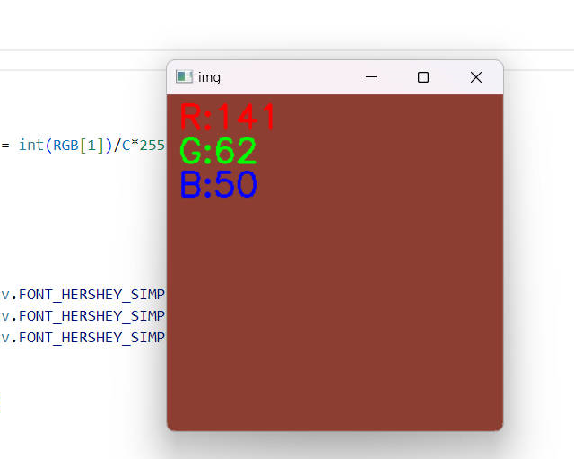

# RGBColorSensor

**[中文](./README.md) / [English](./README_EN.md)**


This is a color acquisition device based on TCS34725 multi-channel light sensor, using stm32f103c8t6 microcontroller, collecting the original value of the color sensor, and normalizing the RGB component by the light intensity component. By uploading the raw data of the sensor to the host computer, we can easily visualize the RGB color space and color space transformation, such as RGB2HSV, RGB2HSL, RGB2Lab (with the help of the OPENCV-python library).<(￣︶￣)↗[GO!]

## Sample

1. 


2. 

   

   

   

## Usage

```Shell
#just git clone or download the zip
```

## Contributing

- @**[MJJ](https://github.com/2481366805)** a kind friend

## License

[GPL: General Public License](LICENSE) 